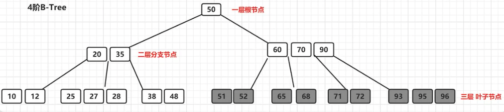
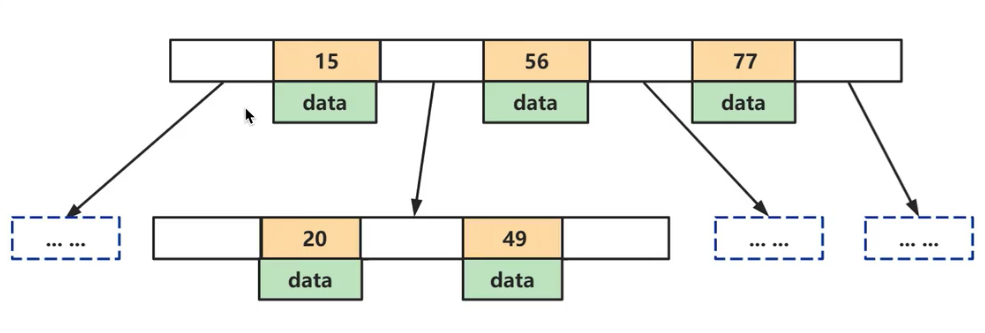
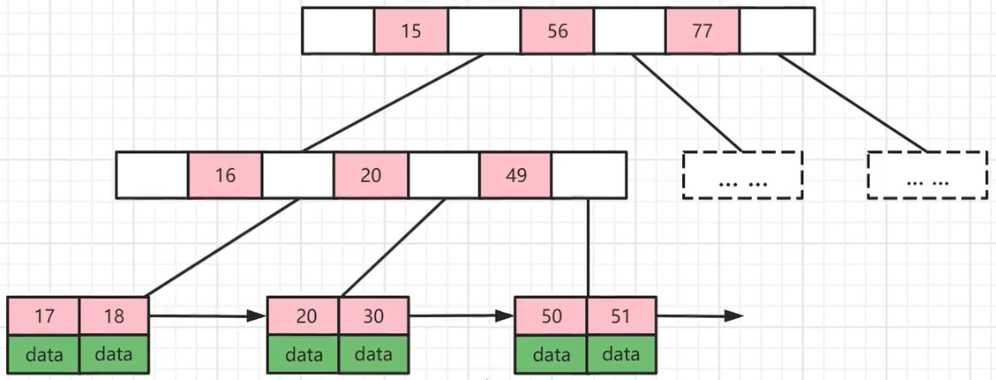

### B-Tree

B-Tree 是一种平衡的多路查找树, B-Tree 允许一个节点存放多个数据, 这样可以尽可能的减少树的深度的同时, 存放更多的数据(把瘦高的树变的矮胖)

B-Tree 中所有节点的字数个数的最大值称为 B-Tree 的阶, 用 m 表示. 一颗 m 阶的 B-Tree, 如果不为空, 就必须满足以下条件

1.   每个节点最多拥有 m-1 个关键字(根节点除外), 也就是 m 个子树
2.   根节点至少用两个子树(可以没有子树, 有的话就必须是 2 个及以上)
3.   分支节点至少有(m/2)颗子树(除去根节点和叶子节点,其它都是分支节点)
4.   所有叶子节点都在同一层, 并且以升序排序

#### 什么是 B-Tree 的阶

所有节点中, 节点[60, 70,90]拥有子节点数目最多, 4 个子节点(灰色部分), 所以上面的 B-Tree 为 4 阶 B 树

#### B-Tree 结构存储索引的特点

为了描述 B-Tshouxian 定义一条数据为一个键值对, key 为记录的键值, 对应表中的主键值(聚簇索引), data 位一行记录中除了主键外的数据. 对于不同的记录, key 值互不相同

-   索引值和 data 数据分布在整颗树结构中
-   白色块部分是指针, 存储着子节点的地址信息
-   每个节点可以存放多个索引值以及对应的 data 数据
-   树节点中的多个索引值从左到右升序排列

#### B-Tree的查找操作

B-Tree的每个节点的元素可以视为一次 IO 读取, 树的高度表示最多的 IO 次数, 在相同数量的总元素个数下, 每个节点的元素个数越多, 高度越低, 查询所需的 IO 次数越少

#### B-Tree 总结

-   优点: B-Tree 可以在内存节点存储键值和相关记录数据, 因此把频繁访问的数据放在靠近根节点的位置将大大提高热点数据的查询效率
-   缺点: B-Tree 中每个节点不仅包含数据的 key 值, 还有 data 数据, 所以当 data 数据较大时, 会导致每个节点存储的 key 值减少, 并且导致 B-Tree 的层数变高, 增加查询时的 IO 次数
-   使用场景: B-Tree 主要应用于文件系统以及部分数据库的索引, 大部分关系型数据库索引则是使用 B+Tree 实现

### B+Tree

B+Tree 是在 B-Tree 基础上的一种优化, 使其更适合实现存储索引结构, InnoDB 存储引擎就是用 B+Tree 实现其索引结构

#### B+Tree 特征

-   非叶子节点只存储键值信息
-   所有叶子节点之间都有一个链表指针
-   数据记录都存放在叶子节点

#### B+Tree 的优势

1.   B+Tree 是 B-Tree 的变种, B-Tree 能解决的问题, B+Tree 也能够解决(降低树的高度, 增大节点存储数据量)
2.   B+Tree 扫库和扫表能力更强, 如果我们要根据索引去进行数据表的扫描, 对 B-Tree 进行扫描, 需要把整颗树遍历一遍, 而 B+Tree 只需要遍历它的所有叶子节点即可(叶子节点之间有引用)
3.   B+Tree 磁盘读写能力更强. 而叶子节点不保存子节点引用. 所以, B+Tree 读写一次磁盘加载的关键字比 B-Tree 更多
4.   B+Tree 排序能力更强, B+Tree 天然具有排序功能
5.   B+Tree 的查询效率更加稳定, 每次查询数据库, 查询 IO 次数一定是稳定的