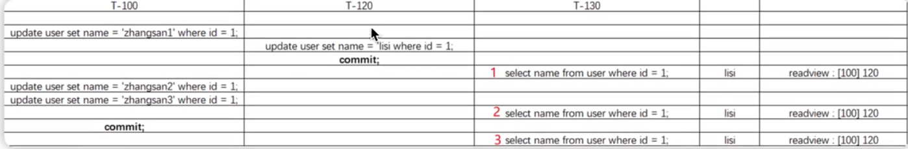
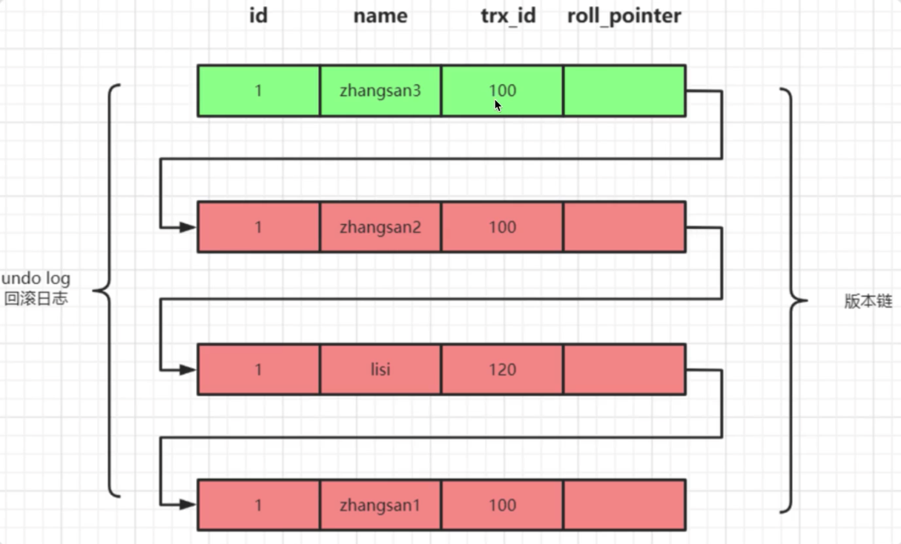

### MVCC 概念

MVCC(Multi Version Concurrency Control) 被称为多版本并发控制, 是指在数据库中为了实现高并发的数据访问, 对数据进行多版本处理, 并通过事务的可见性来保证事务能看到自己应该看到的数据版本

>   MVCC 最大的好处是读不加锁, 读写不冲突. 在读多写少的系统应用中, 读写不冲突是非常重要的, 极大的提升系统的并发性能, 这也是为什么现阶段几乎所有的关系型数据库都支持 MVCC 的原因, 不过目前 MVCC 只在 Read Commited 和 Repeatable Read 两种隔离级别下工作

#### 行记录的三个隐藏字段

-   **DB_ROW_ID**: 如果没有为表显示的定义主键, 并且表中也没有定义唯一索引, 那么 InnoDB 会自动为表添加一个 row_id 隐藏列作为主键
-   **DB_TRX_ID**: 事务中某条记录做增删改时, 就会将这个事务的事务 ID 写入到 trx_id 中
-   **DB_ROLL_PTR**: 回滚指针, 指向 undo log 的指针

#### Undo log 多版本链

如下图举例: 事务 T-100 和 T-120 对表中 id=1 的数据行做 update 操作, 事务 T-130 进行 select 操作, 即时T-100 已经提交修改, 三次 select 语句的结果都是"lisi"

-   每一条数据都有多个版本, 版本之间通过 undo log链接进行链接
-   

#### ReadView

ReadView 是 InnoDB 在实现 MVCC 是用到的一致性读试图, 即 consistent read view, 用于支持 RC(Read Commited) 和 RR(Repeatable Read)隔离级别的实现

Read View 简单理解就是对数据在每个时刻的状态拍成照片记录下来, 那么之后获取某个时刻的数据时就还是原来的照片数据, 是不会变的

Read View 中有比较重要的 4 个字段:

-   **m_ids**: 用来表示 MySQL 中哪些事务正在执行, 但是还没有提交
-   **min_trx_id**: 就是 m_ids 里最小的值
-   **max_trx_id**: 下一个要生成的事务 ID 值, 也就是最大事务 ID
-   **creator_trx_id**: 当前这个事务的 ID

#### 通过 Read View判断记录的某个版本是否可见的方式总结:

-   trx_id = creator_trx_id

    表示当前事物在访问自己修改过的记录, 该版本可以被当前事务访问

-   trx_id < min_trx_id

    表明生成该版本的事务在当前事物生成 read view前已经提交, 该版本可以被当前事物访问

-   trx_id >= max_trx_id

    表明生成该版本的事务在当前事务生成 readview 才开启, 该版本不可以被当前事物访问

-   trx_id > min_trx_id && trx_id < max_trx_id

    需要判断 trx_id 属性值是不是在 m_ids 列表中

    -   在: 说明创建 readview 时生成该版本的事务还是活跃的, 该版本不可以被访问
    -   不在: 说明创建 readview 时生成该版事务已经被提交, 该版本可以访问

#### 何时生成 Readview 快照

-   在 RC 隔离级别下,每次一次读取数据前都生成一个 Readview
-   在 RR 隔离级别下, 在一个事务中, 只在第一次读取数据前生成一个 Readview

#### 快照读与当前读

在 MVCC 并发控制中, 读操作可以分为两类: 快照读与当前读

-   快照读

    快照读是指读取数据时不是读取最新版本的数据, 而是基于历史版本读取的一个快照信息(mysql 读取 undo log历史版本), 快照读可以使普通的 select 读取数据时不用对表数据进行加锁, 从而解决了因为数据库加锁而导致的两个问题:

    -   解决了因为加锁导致的读取数据时无法读取数据的问题
    -   解决了因为加锁导致读取数据时无法对数据进行修改的问题

-   当前读

    当前读是读取数据库最新的数据, 当前读和快照读不同, 因为要读取最新的数据而且要保证事务的隔离性, 所以当前读是需要对数据进行加锁的(`select for update`为当前读)

#### 总结

-   并发环境下, 写-写操作有加锁解决方案, 但为了提高性能, InnoDB 提供 MVCC, 目的是为了解决读-写, 写-读操作下不加锁仍能安全进行
-   MVCC 过程, 本质就是访问版本链, 并判断哪个版本可见的过程. 该判断算法是通过版本上的 trx_id 与快照 Readview 的若干个信息进行对比
-   快照生成的时机因隔离级别不同, RC 下每次读取前都会生成一个快照 Readview, RR 仅在一个事物中, 第一次读取前生成一个快照