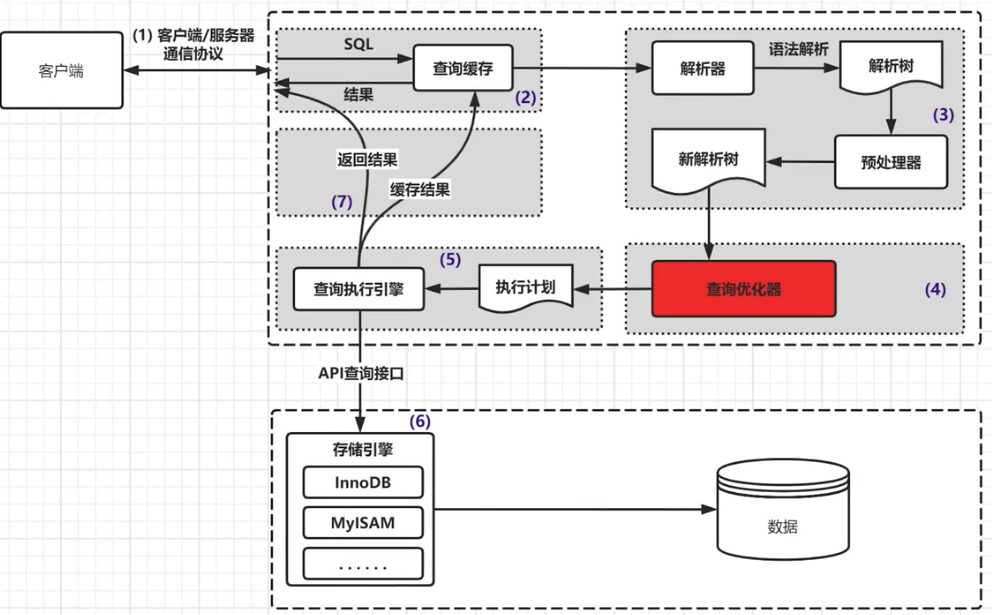
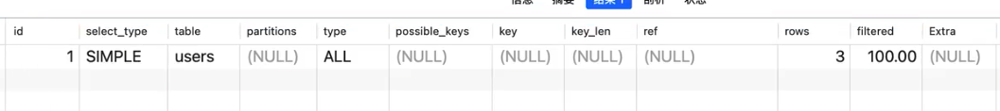
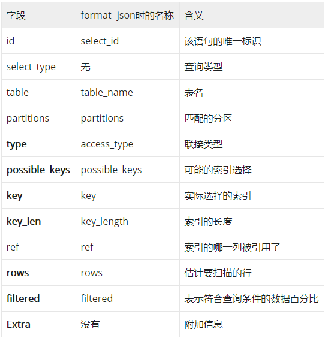
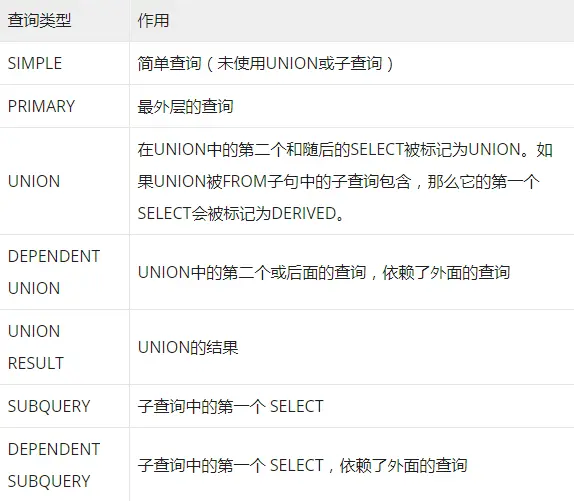

使用 `explain` 关键字可以模拟优化器来执行 sql 查询语句, 从而知道 MySQL 是如何处理 sql 语句的. 分析出查询语句或者表结构的性能瓶颈

**MySQL 查询过程**

通过 explain 可以获得以下信息:

-   表的读取顺序
-   数据读取操作的操作类型
-   哪些索引可以被使用
-   哪些索引真正被使用
-   表的直接引用
-   每张表有多少行被优化器查询了

**ID**

​	该语句的唯一标识。如果explain的结果包括多个id值，则数字越大越先执行；而对于相同id的行，则表示从上往下依次执行。

**select_type**

​	查询类型，有如下几种取值：

**table**

​	表示当前这一行正在访问哪张表，如果SQL定义了别名，则展示表的别名

**partitions**

​	当前查询匹配记录的分区。对于未分区的表，返回null

**type**

​	连接类型，有如下几种取值，**性能从好到坏排序** 如下：

-   system：该表只有一行（相当于系统表），system是const类型的特例
-   const：针对主键或唯一索引的等值查询扫描, 最多只返回一行数据. const 查询速度非常快, 因为它仅仅读取一次即可
-   eq_ref：当使用了索引的全部组成部分，并且索引是PRIMARY KEY或UNIQUE NOT NULL 才会使用该类型，性能仅次于system及const
-   ref: 当满足索引的最左前缀规则，或者索引不是主键也不是唯一索引时才会发生。如果使用的索引只会匹配到少量的行，性能也是不错的。
-   fulltext：全文索引
-   ref_or_null：该类型类似于ref，但是MySQL会额外搜索哪些行包含了NULL。这种类型常见于解析子查询
-   index_merge：此类型表示使用了索引合并优化，表示一个查询里面用到了多个索引
-   unique_subquery：该类型和eq_ref类似，但是使用了IN查询，且子查询是主键或者唯一索引。
-   index_subquery：和unique_subquery类似，只是子查询使用的是非唯一索引
-   range：范围扫描，表示检索了指定范围的行，主要用于有限制的索引扫描。比较常见的范围扫描是带有BETWEEN子句或WHERE子句里有>、>=、<、<=、IS NULL、<=>、BETWEEN、LIKE、IN()等操作符。
-   index：全索引扫描，和ALL类似，只不过index是全盘扫描了索引的数据。当查询仅使用索引中的一部分列时，可使用此类型。有两种场景会触发：
    -   如果索引是查询的覆盖索引，并且索引查询的数据就可以满足查询中所需的所有数据，则只扫描索引树。此时，explain的Extra 列的结果是Using index。index通常比ALL快，因为索引的大小通常小于表数据。
    -   按索引的顺序来查找数据行，执行了全表扫描。此时，explain的Extra列的结果不会出现Uses index。

-   ALL：全表扫描，性能最差。

**possible_keys**

​	展示当前查询可以使用哪些索引，这一列的数据是在优化过程的早期创建的，因此有些索引可能对于后续优化过程是没用的。

**key**

​	表示MySQL实际选择的索引

**key_len** 

​	索引使用的字节数。由于存储格式，当字段允许为NULL时，key_len比不允许为空时大1字节。

**ref**

​	表示将哪个字段或常量和key列所使用的字段进行比较。

​	如果ref是一个函数，则使用的值是函数的结果。要想查看是哪个函数，可在EXPLAIN语句之后紧跟一个SHOW WARNING语句。

**rows**

​	MySQL估算会扫描的行数，数值越小越好。

**filtered**

​	表示符合查询条件的数据百分比，最大100。用rows × filtered可获得和下一张表连接的行数。例如rows = 1000，filtered = 50%，则和下一张表连接的行数是500。

**Extra**

​	展示有关本次查询的附加信息