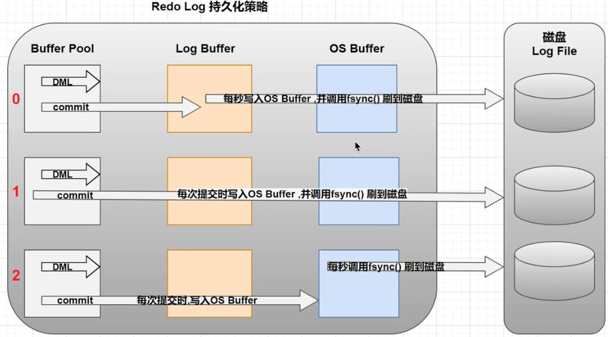

#### redo log 持久化

缓冲区数据一般情况下是无法直接写入磁盘的, 中间必须经过操作系统缓冲区(OS Buffer). 因此 redo log buffer 写入 redo log file 实际上是先写入 OS Buffer, 然后在通过系统调用 fsync() 将其刷到 redo log file

redo Buffer 持久化到 redo log 的策略,  可通过`Innodb_flush_log_at_trx_commit` 设置:

| 参数值            | 含义                                                         |
| ----------------- | :----------------------------------------------------------- |
| 0(延迟写)         | 事务提交时不会将redo log buffer 中的日志写入到 os buffer, 而是每秒写入到 os buffer 并调用 fsync()写入到 redo log file 中. 也就是说设置为 0 时是(大约)每秒刷新写入到磁盘中, 当系统崩溃, 会丢失 1 秒钟的数据 |
| 1(实时写, 实时刷) | 事务每次提交都会将 redo log buffer 中的日志写入到 os buffer 并调用 fsync()刷到 redo log file 中. 这种方式即时系统崩溃也不会丢失任何数据, 但是因为每次提交都写入到磁盘, IO 的性能较差 |
| 2(实时写, 延迟刷) | 每次提交都仅写入到 os buffer, 然后每秒调用 fsync 将 os buffer 中的日志写入到 redo log file |

一般建议选择取值 2, 因为 mysql 挂了数据没有丢失, 整个服务器挂了才会损失 1 秒的事务提交数据

#### undo log 持久化

Mysql 中的 undo log严格讲并不是 log, 而是数据, 因此他的管理和落盘都跟数据一样的:

-   undo 的磁盘结构并不是顺序的, 而是像数据一样按 page 管理
-   undo 写入时, 也想数据一样产生赌赢的 redo log(因为 undo 也是对页面的修改, 记录 undo 这个操作本身也会有对应的 redo)
-   undo 的 Page 也像数据一样缓存在 Buffer Pool 中,跟数据 Page 一起做 LRU 换入换出, 以及刷脏. undo page 的刷脏也像数据一样要等到对应的 redo log 落盘之后

当事务提交的时候, InnoDB 不会立即删除 undo log, 因为后续还可能会用到 undo log, 如隔离级别 RR 时, 事务读取的都是开始事务时的最新提交行版本, 只要该事物不结束, 该行版本就不能删除, 即 undo log 不能删除

但是在事务提交的时候, 会将该事物对应的 undo log 放入到删除列表中, 未来通过 purge 来删除. 并且提交事务时, 还会判断 undo log 分配的页是否可以重用, 如果可以重用, 则会分配给后面来的事务, 避免为每个独立的事务分配独立的 undo log 页而浪费存储空间和性能