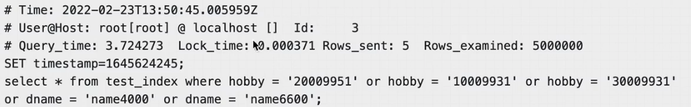

### 慢查询日志

#### MySQL 慢查询的相关参数解释

-   **slow_query_log**: 是否开启慢查询日志, `ON(1)`表示开启, `OFF(0)`表示关闭
-   **slow-query-log-file**: MySQL(5.6 以以上版本)数据库慢查询日志存储路径
-   **long_query_time**: 慢查询**阈值**, 当查询时间多于设定阈值时, 记录日志

默认情况下 slow_query_log 值为 OFF

#### 日志内容

下图是慢日志其中一条 sql 的记录内容

-   Time: 执行时间
-   User: 用户信息, ID 信息
-   Query_time: 查询时长
-   Lock_time: 等待锁的时长
-   Rows_sent: 查询结果的行数
-   Rows_examined: 查询扫描的行数
-   SET timesatmp: 时间戳
-   SQL 的具体信息

### 慢查询优化思路

#### SQL 性能下降的原因

执行性能下降可以体现在以下 2 个方面

-   等待时间长: 
    -   锁表导致查询一直处于等待状态
-   执行时间长:
    -   查询语句写的烂
    -   索引失效
    -   关联查询太多 join
    -   服务器调休及各个参数的设置

#### 慢查询优化思路

1.   优先选择高并发执行的 SQL, 因为高并发的 SQL 发生问题带来的后果更严重

2.   定位优化对应的性能瓶颈(在优化前了解性能瓶颈在哪)

     1.   IO(数据访问消耗了太多的时间, 查看是否正确使用了索引)
     2.   CPU(数据运算花费了太多时间, 数据的运算分组, 排序是不是有问题)
     3.   网络带宽(加大网络带宽)

3.   明确优化目标

4.   从 explain 执行计划入手

5.   永远用小结果集驱动大的结果集(小表驱动大表)

6.   尽可能在索引中完成排序

     1.   排序操作用的比较多, order by 后面的字段如果在索引中, 索引本身就是排好序的,所以速度很快, 没有索引的话, 就需要从表中拿数据, 在内存中进行排序, 如果内存空间不够还会发生落盘操作

7.   只获取自己需要的列

     1.   不要使用 select * 

8.   只使用最有效的过滤条件

     1.   where 后面的条件并不是越多越好, 应该用最短路径访问到数据

9.   尽可能避免复制的 join 和子查询

     1.   每条 SQL 的 join 操作, 建议不要超过三张表
     2.   将复杂的 SQL,拆分成多个小 SQL单表执行, 获取结果后再程序中进行封装

10.   合理设计并利用索引

      1.   较为频繁的作为查询条件的字段应该创建索引

      2.   唯一性太差的字段不适合单独创建索引, 如状态类字段, 性别字段

      3.   更新非常频繁的字段不适合创建索引

      4.   不会出现在 where 子句中的字段不该创建索引

      5.   对于单键索引, 尽量选择当前 Query 过滤性更好的索引

      6.   选择联合索引时, 当前 Query 中过滤性最好的字段在索引中排列要靠前

      7.   选择联合索引时, 尽量选择出现在 where 中比较多的字段

           