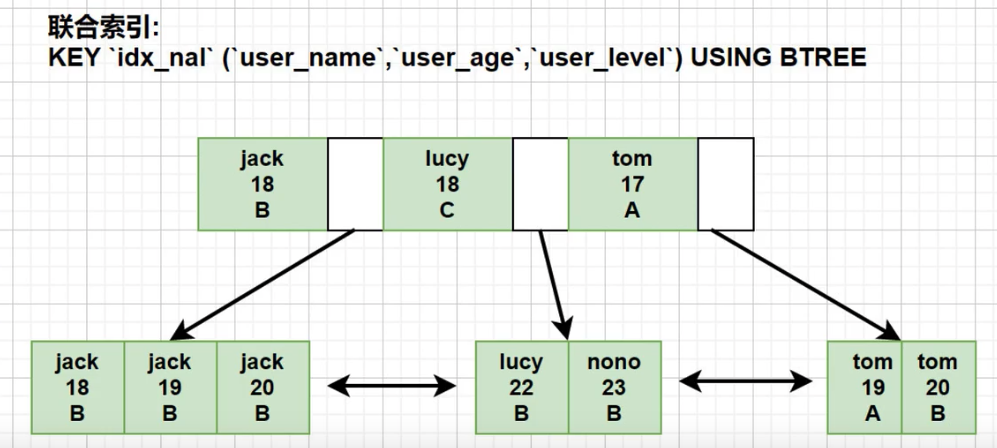

### 最佳左前缀法则

如果创建的是联合索引, 就要遵循该法则. 使用索引时, where 后面的条件需要从索引的最左前列开始使用, 并且不能跳过索引中的列使用

-   场景 1: 按照索引字段顺序使用, 三个字段都是用了索引, 没有问题

    ```sql
    explain select * from users where user_name = 'tom' and user_age = 17 and user_level = 'A';
    ```

-   场景 2: 直接跳过 user_name 使用索引字段, 索引无效, 未使用到索引

    ```sql
    explain select * from users where user_age = 17 and user_level = 'A'
    ```

-   场景 3: 不按照创建联合索引的顺序, 使用索引

    ```sql
    explain select * from users where user_age = 17 and user_anme = 'tom' and user_level = 'A'
    ```

    where后面查询条件顺序是`user_age`, `user_level`, `user_name`与我们创建的索引顺序`user_name,user_age,user_level` 不一致, 为什么还是使用了索引, 原因是 MySQL 地城优化器对其进行了优化

-   最佳左前缀底层原理

    MySQL 创建联合索引的规则是: 首先会对联合索引最左边的字段进行排序(例子中是`user_name`), 在第一个字段的基础之上, 在对第二个字段进行排序(例子中是`user_age`)

    