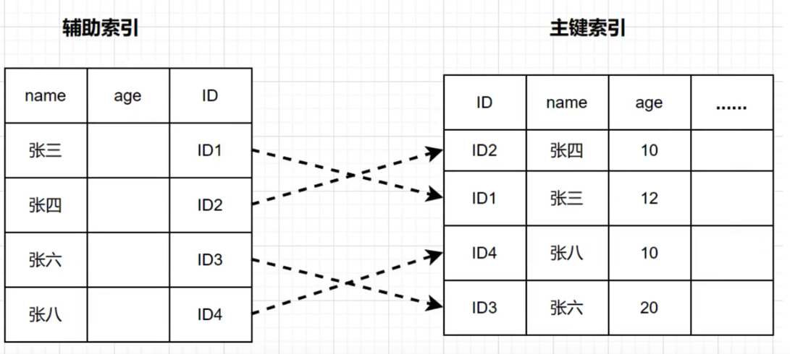
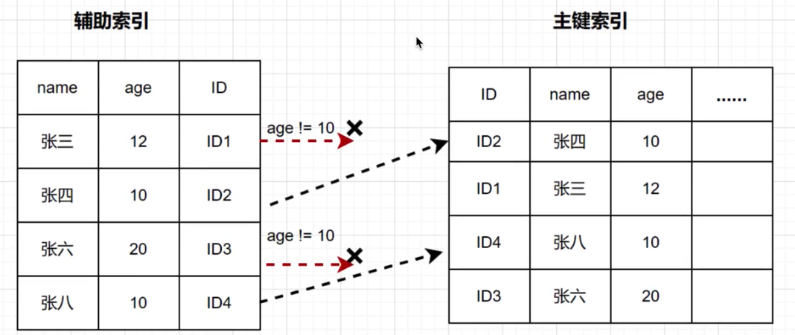

索引下推(index condition pushdown) 简称 ICP, 在MySQL5.6 版本推出, 用于优化查询

需求: 查询 users表中 "名字第一个字是张, 年龄为 10 岁的所有记录"

```sql
select * from users where user_name like "张%" and user_age = 10;
```

根据最左前缀法则, 该语句在搜索索引树的时候, 只能匹配到名字第一个字是'张'的记录, 接下来是怎么处理的呢? 当然是从该记录开始, 逐个回表, 到主键索引上找出相应的记录, 在比对`age`这个字段的值是否符合

在下图(name, age)索引里面特意去掉了 age 的值, 这个过程 InnoDB 并不会去看 age 的值, 只是顺序把 "name 第一个字是张"的记录一条条取出来回表. 因此, 需要回表 4 次



MySQL5.6 引入了索引下推优化, 可以在索引遍历的过程中, 对索引中包含的字段先做判断, 过滤掉不符合条件的记录, 减少回表字数

下图 InnoDB 在(name, age)索引内部就判断了 age 是否等于 10, 对于不等于 10 的记录,直接判断并跳过, 减少回表次数



总结

如果没有索引下推优化, 当进行索引查询时, 首先根据索引来查找记录, 然后再根据 where 条件来过滤记录

在支持 ICP 优化后, MySQL 会在取出索引的同时, 判断是否可以进行 where 条件过滤在进行索引查询, 也是就说提前执行 where 的部分过滤操作, 在某些场景下, 可以大大减少回表次数, 从而提升整体性能