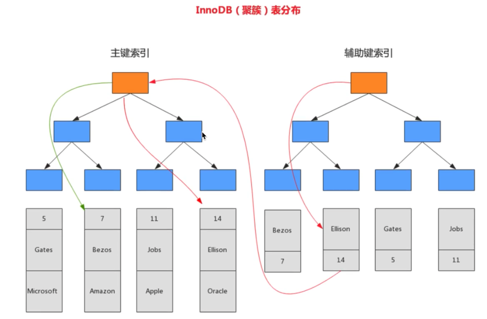
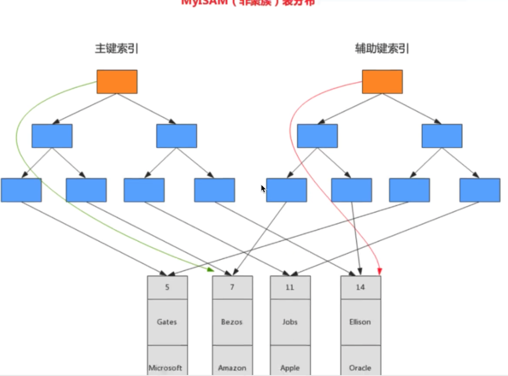

聚簇索引与非聚簇索引的区别是: 叶子节点是否存放一整行记录

-   **聚簇索引**: 将数据存储与索引放到一块, 索引结构的叶子节点保存了行数据
-   **非聚簇索引**: 将数据与索引分开存储, 索引结构的叶子节点指向了数据对应的位置

InnoDB 主键使用的是聚簇索引, MyISAM 不管主键索引, 还是二级索引使用的都是非聚簇索引

在 InnoDB 引擎中, 主键索引采用的就是聚簇索引结构存储

#### 聚簇索引

-   聚簇索引是一种数据存储方式, InnoDB 的聚簇索引就是按照顺序构建 B+Tree 结构. B+Tree 的叶子节点就是行记录, 行记录和主键值紧凑的存储在一起, 这也意味着 InnoDB 的主键索引就是数据表本身, 它按照主键顺序存放了整张表的数据, 占用的空间就是整个表数据量的大小. 通常说的主键索引就是聚簇索引

-   InnoDB 的表要求必须有聚簇索引:

    -   如果表定义了主键, 则主键索引就是聚簇索引
    -   如果表没有定义主键, 则第一个非空 unique 列作为聚簇索引
    -   否则 InnoDB 会从建一个隐藏的 row-id 作为聚簇索引

-   辅助索引

    InnoDB 辅助索引, 也叫二级索引, 时根据索引列构建B+Tree 结构. 但在 B+Tree 的叶子节点中只存了索引列和主键信息. 二级索引占用的空间会比聚簇索引小很多, 通常创建辅助索引就是为了提升查询效率. 一个表 InnoDB 只能创建一个聚簇索引, 但是可以创建多个辅助索引

#### 非聚簇索引

与 InnoDB 表存储不同, MyISAM 使用的是非聚簇索引, 非聚簇索引的两颗 B+Tree 看上去没有什么不同, 节点的结构完全一致, 只是存储的内容不同而已, 主键索引 B+Tree 的节点存储了主键, 辅助索引 B+Tree 存储了辅助键

表数据存储在独立的地方, 这 两颗 B+Tree 的叶子节点都使用一个地址指向真正的表数据, 对于表数据来说, 这两个键没有任何差别. 由于索引树是独立的, 通过辅助键检索无需访问主键的索引树

#### 聚簇索引的优缺点

优点:

1.   当需要取出一定范围内的数据时, 用聚簇索引比用非聚簇索引好
2.   当通过聚簇索引查找目标数据时, 理论上比非聚簇索引快, 因为非聚簇索引定位到对应主键时还要多一次目标记录寻址, 即多一次 IO
3.   使用覆盖索引扫描的查询可以直接使用页节点中的主键值

缺点:

1.   插入速度严重依赖于插入顺序
2.   更新主键代价很高, 因为将会导致被更新的行移动
3.   二级索引访问需要两次索引查找, 第一次找到主键值, 第二次根据主键值找到行数据