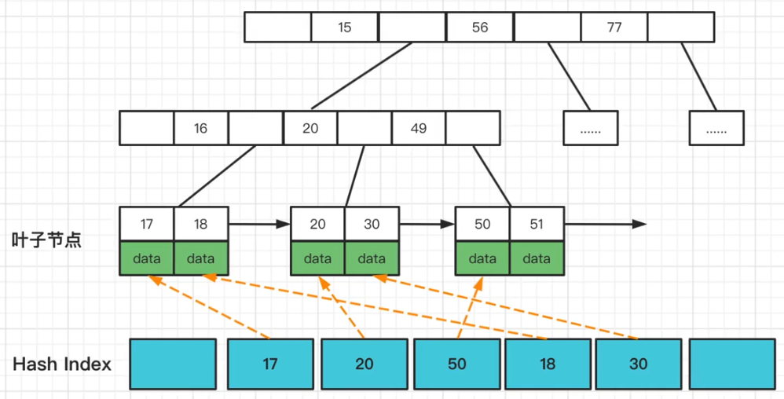

自适应Hash 索引(Adatptive Hash Index, 简称 AHI) 是 InnoDB 的三大特性之一, 另外 两个是 Buffer Pool 简称 BP 与双写缓冲区(Doublewrite Buffer)

1.   自适应即不需要我们自己处理, 当 InnoDB 引擎根据查询统计发现某一个查询满足 hash 索引的数据结构特点,就会给其建立一个 hash 索引
2.   hash 索引底层的数据结构是散列表(hash 列表), 其数据特点就是比较适合在内存中实用, 自适应 Hash 索引存在 InnoDB 架构中的缓存中(不存在磁盘架构中),
3.   自适应 Hash 索引只适合搜索等值查询, 如 `select * from table where index_col = 'xxx'`, 而对于其他查找类型, 如范围查询, 是不能使用的

Adapttive Hash Index 是针对 B+Tree Search Path 的优化, 因此所有会涉及到 Search Path 的操作, 均可使用此 Hash 索引进行优化



根据索引键值(前缀)快速定位到叶子节点满足条件记录的 Offset, 减少 B+Tree Search Path 的代价, 将 B+Tree 从 Root 节点至叶子节点的路径定位, 优化为 Hash Index 的快速查询

InnoDB 的自适应 hash 索引是默认开启的, 可以通过配置下面的参数设置进行关闭

```shell
innodb_adaptive_hash_index = off
```

自适应 Hash 索引使用分片进行实现的, 分片数可以使用配置参数设置

```shell
innodb_adaptive_hash_index_parts = 8
```

