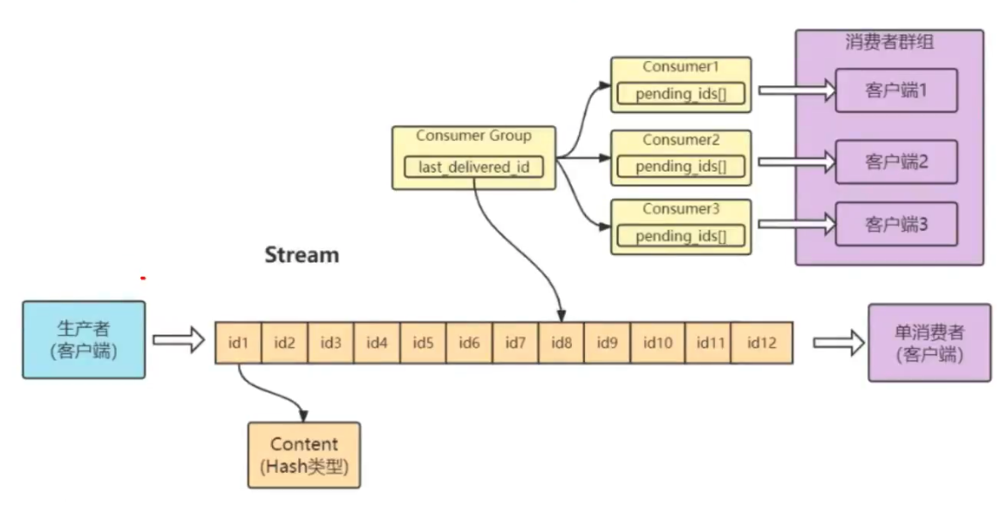

### 基于 List 的 LPUSH+BRPOP 的实现

足够简单, 消费消息延迟几乎为零, 但是需要处理空闲连接的问题

如果线程一直阻塞在那里, Redis 的客户端连接就成了闲置连接, 闲置过久, 服务器一般会主动断开连接, 减少闲置资源占用, 这个时间 blpop 和 brpop 或抛出异常, 所以在编写客户端消费的时候要小心, 如果捕获到异常, 还要重试

其他缺点包括:

1.   做消费者确认 ACK 麻烦, 不能保证消费者消费消息后是否成功处理的问题(党纪或者异常处理等), 通常需要维护一个 Pending 列表, 保证消息处理确认; 
2.   不能做广播模式, 如 pub/sub, 消息发布/订阅模型
3.   不能重复消费, 一旦消费就会被删除
4.   不支持分组消费

### 基于 Sorted-Set 的实现

用多来实现延迟队列, 当然也可以实现有序的普通消息队列, 但是消费者无法阻塞的获取消息, 只能轮训, 不允许消费重复

### PUB/SUB, 订阅/发布模式

优先:

1.   典型的广播模式, 一个消息可以发布到多个消费者
2.   多信道订阅, 消费者可以同时订阅多个信道, 从而接受多类消息
3.   消息即时发送, 消息不用等待消费者读取, 消费者会自动接收到信道不发的消息

缺点:

1.   消息一旦发布, 若不能接收, 则 消息丢失, 不能寻回
2.   不能保证每个消费者接收的时间是一致的
3.   若消费者客户端出现消息积压, 到一定程度, 会被强制断开, 导致消息意外丢失. 通常发生在消息的生产远大于消费速度时

可见 Pub/Sub 模式不适合做消息存储, 消息积压类的业务, 而是擅长处理广播, 即时通讯, 即时反馈的业务

### 基于 Stream 类型实现

基本上已经有了一个消息中间件的雏形, 可以考虑在生产过程中使用

### 消息队列问题

#### Stream 消息太多怎么办

要是消息累计太多, Stream 的链表会很长, 内容会不会爆掉? xdel 指令又不会删除消息, 他只是给消息做了一个标志位

Redis 本身考虑到了这一点, 所以它提供了一个定长 Stream 功能. 在 xass 的指令提供一个定长长度 maxlen, 就可以将老掉的消息干掉, 确保最对不超过指定长度

#### 消息如果忘记 ACK 会怎么样

Stream 在每个消费者结构中保存了正在处理中的消息 ID 列表 PEL, 如果消费者收到了消息处理完了但是没有回复 ack, 就会导致 PEL 列表不断增长, 如果有很多消费组的话, 那么这个 PEL 占用的内存就会放大么. 所以消息要尽可能的快速消费确认

#### PEL 如何避免消息丢失

在客户端消费者读取 Stream 消息时, Redis 服务器将消息回复给客户端的过程中, 客户端突然断开了连接, 消息就丢失了. 但是 PEL 里已经保存了发出去消息的 ID. 待客户端重连之后, 可以再次收到 PEL 中的消息 ID列表. 不过此时 xreadgroup 的起始消息ID 不能为参数, 而必须是任意有效的消息 ID, 一般将参数设为 0-0, 表示读取所有 PEL 消息以及自 last_delivered_id 之后的新消息

#### 死信问题

如果某个消息, 不能被消费者处理, 也就是不能被 XACK, 这是要长时间处于 Pending 列表中, 即时被反复的转移给各个消费者也是如此. 此时该消息的 delivery counter(通过 XPENDING 可以查询到)就会累加, 当累加到某个我们预设的临界值时, 我们就认为是坏消息(也叫死信, DeadLetter, 无法投递的消息), 由于有了判定条件, 我们将坏消息处理掉即可, 删除即可. 删除一个消息, 使用 XDEL 语法, 注意, 这个命令并没有删除 Pending中的消息, 可以在执行 XDEL 之后, XACK 这个消息标识其处理完毕

#### Stream 的高可用

Stream 的高可用是建立在主从复制的基础上的

#### 分区 Partition

Redis 没有原生支持分区能力, 如果想要使用分区, 那就需要分配多个 Stream, 然后在客户端使用一定策略来生产消息到不同的 Stream

### Stream 小结

Stream 的消费模型借鉴了 Kafka 的消费分组的概念, 它弥补了 Redis Pub/Sub 不能持久化消息的缺陷. 但是它有不同于 Kafka, Kafka 的消息可以分 partition, 而 Stream 不行. 如果非要 partition 的话, 得在客户端做, 提供不同的 Stream 名称, 对消息进行 hash 取模来选择往哪个 Stream 里塞