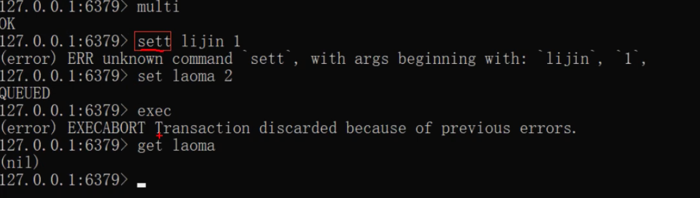
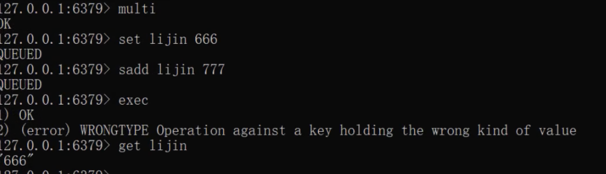

### 事务

简单地说, 就是一组动作, 要么全部执行, 要么全部不执行

例如, 在社交网站上用户 A 关注用户 B, 那么需要再用户 A 的关注表中加入 B, 在用户 B 的粉丝表中添加 A, 这 2 个行为要么全部执行, 要么全部不执行, 否则会出现数据不一致的情况

Redis 提供简单的事务功能, 将一组需要一起执行的命令放到 `multi`和 `exec` 两个命令之间, multi 命令代表事务开始, exec 命令代表事务结束, 另外`discard` 命令是回滚

**Redis 的事务功能很弱, 在事务的回滚机制上, Redis 只能对基本的语法错误进行判断**

1.   语法命令错误

例如下面操作将 set 写成了 sett, 属于语法错误, 会造成整个事务无法执行, 事务内的操作都没有执行

1.   运行时错误

可以看到 Redis 并不支持回滚功能, 第一个 set 命令已经执行成功, 需要开发人员自己修复这类问题

### Redis 事务的原理

事务是 Redis 实现在服务器端的行为, 用户执行`multi`命令时, 服务器会将这个用户的客户端对象设置为一个特殊状态, 在这个状态下后续用户的查询命令不会真的被执行, 而是被服务器缓存起来, 直到用户执行`exec`命令为止, 服务器会将这个用户对应的客户端对象中的缓存命令按照提交的顺序依次执行

### Redis 的 watch 命令

有些应用场景需要再事务之前, 确保事务中的 key 没有被其它客户端修改过, 才执行事务, 否则不执行(类似乐观锁). Redis 提供了 `watch` 命令来解决这类问题