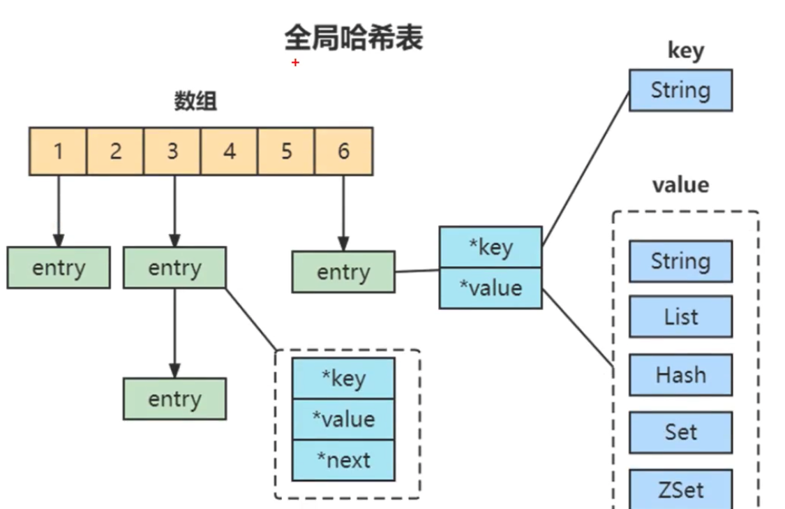
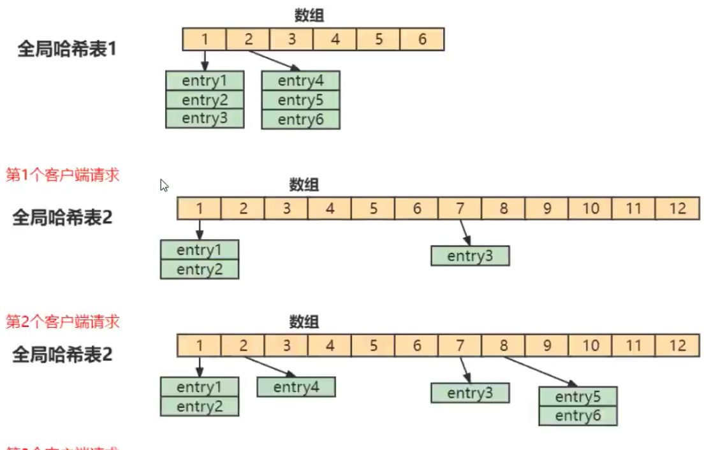

1.   纯内存访问
2.   单线程避免上下文切换
3.   渐进式 ReHash, 缓存时间戳

### 全局哈希表

为了实现从键到值的快速访问, Redis 使用了一个哈希表来保存所有键值对. 一个哈希表, 其实就是一个数组, 数组的每个元素称为一个哈希桶. 所以, 我们常说, 一个哈希表是由多个哈希桶组成的, 每个哈希桶中保存了键值对数据

哈希桶中的 entry 元素中保存了 key 和 value 指针, 分别指向了实际的键和值, 这样一来, 即时值是一个集合, 也可以通过*value指针被查找到. 因为这个哈希表保存了所有的键值对, 所以, 它也称为全局哈希表

哈希表的最大好处很明显, 就是可以用 O(1)的时间复杂度来快速查找到键值对: 我们只需要通过计算键的哈希值, 就可以知道它所对应的哈希桶的位置, 然后就可以访问相应的 entry 元素

但当你往 Redis 中写入大量数据后, 就可能会发现操作有时候突然变慢了. 这其实就是因为你忽略了一个潜在的风险点, 那就是哈希表的冲突问题和 ReHash 可能带来的操作阻塞

当时你往哈希表中写入更多数据时, 哈希冲突是不可避免的问题. 这里的哈希冲突, 两个 key 的哈希值和哈希桶计算对应关系时, 正好落在了同一个哈希桶中

redis 解决哈希冲突的方式, 就是链式哈希. 链式哈希就是指, 同一个哈希桶中的多个元素用一个链表来保存, 它们之间一次用指针连接

但是如果这个数组一直不变, 那么 hash 冲突会变很多, 这个时候检索效率就会大打折扣, 所以 Redis 就需要把数组进行扩容 (一般是扩大到原来的两倍), 但是问题来了, 扩容后每个 hash 桶的数据会分散到不同的位置, 这里涉及到元素的移动, 必定会阻塞 IO, 所以这个 ReHash 过程会导致很多请求阻塞

### 渐进式 ReHash

为了避免上述问题, Redis 采用了渐进式 ReHash

首先, Redis 默认使用了 2 个全局哈希表: 哈希表 1 和哈希表 2. 一开始, 当插入数据时, 默认使用哈希表 1, 此时哈希表 2 并没有被分配空间. 随着数据逐步增多, Redis 开始执行 ReHash

1.   给哈希表 2 分配更大的空间, 例如是当前哈希表 1 大小的 两倍
2.   把哈希表 1 中的数据重新映射并拷贝到哈希表 2 中
3.   释放哈希表 1 的空间

在上面的第二部涉及大量的数据拷贝, 如果一次性把哈希表 1 中的数据都迁移完成, 会造成 Redis 线程阻塞, 无法服务其他请求. 此时, Redis 就无法快速访问数据了

在Redis 开始执行 rehash 时, Redis 仍然正常处理客户端请求, 但是要加入一个额外的处理

处理第 1 个请求时, 把哈希表 1 中的第 1 个索引位置上的所有 entried 拷贝到哈希表 2 中

处理第 2 个请求时,  把哈希表 1 中的第 2 个索引位置上所有的 entries 拷贝到哈希表 2 中

如此循环, 直到把所有的索引位置数据都拷贝到哈希表 2 中

这样就巧妙的把一次性大量拷贝的开销, 分摊到了多次处理请求的过程中, 避免了耗时操作, 保证了数据的快速访问.

所以这里基本上也可以确保根据 key 找 value 的操作在 O(1)左右

不过这里要注意,  如果Redis 中有海量的 key 值的话,这个 rehash 过程会很长很长, 虽然采用渐进式 rehash, 但是在 rehash 过程中还是会导致请求有不小的卡顿. 并且想一些统计命令也会非常卡顿: 比如 keys

### 缓存系统时间戳

Redis 中并不直接调用系统时间戳, 系统调用相对来说比较费时, 作为单线程的 Redis 承受不起, 所以它需要对时间进行缓存, 有一个定时任务, 每毫秒更新一次时间缓存, 获取时间都是从缓存中直接拿