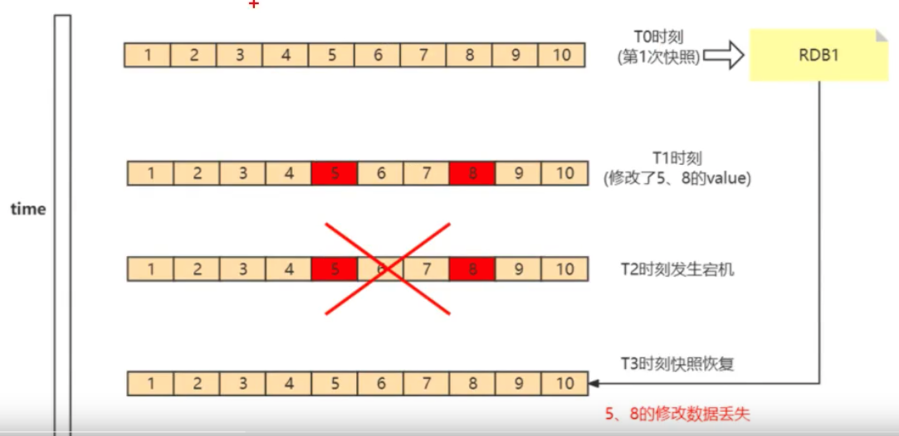
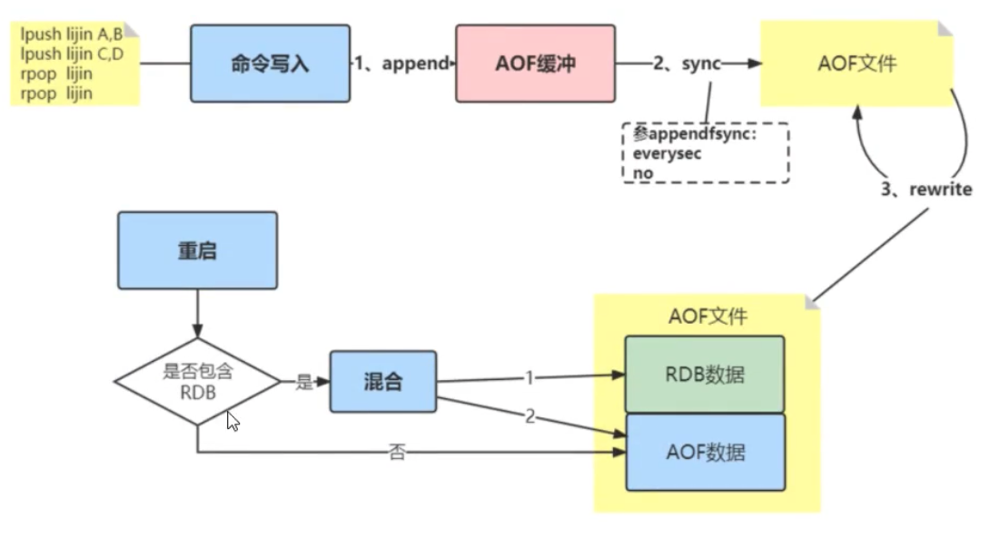

## 持久化

redis 虽然是个内存数据库, 但是 redis 支持 RDB 和 AOF 两种持久化机制, 将数据写往磁盘, 可以有效避免因进程退出造成的数据丢失问题, 当下次重启是利用之前持久化的文件即可实现数据恢复

### RDB

RDB 持久化是把当前进程数据生成快照保存到硬盘的过程. 所谓内存快照, 就是指内存中的数据在某一时刻的状态记录. 这就类似于照片, 当你给朋友拍照时, 一张照片就能把朋友一瞬间的形象完全记下来. RDB 就是 Redis DataBase 的缩写

#### 给那些内存数据做快照?

Redis 的数据都在内存中, 为了提供所有数据的可靠性保证, 他执行的是全量快照, 也就是说, 把内存中所有的数据都记录到磁盘中. 但是, RDB 文件就越大, 往磁盘上写数据的时间开销就越大

#### RDB 文件的生成是否会阻塞主线程

Redis 提供了 2 个命令来生成 RDB 文件, 分别是save 和 bgsave

save: 在主线程中执行, 会导致主线程阻塞; 对于内存比较大的实例会造成长时间阻塞, 线上环境不建议使用

bgsave: 创建一个子进程, 专门用于写入 RDB 文件, 避免了主线程的阻塞, 这也是 Redis RDB 文件生成的默认配置

#### RDB 导致数据丢失问题

针对 RDB 不适合实时持久化的问题, Redis 提供了 AOF 持久化方式来解决

如下图所示, 我们现在 T0 时刻做了一次快照(下一次快照是 T4 时刻), 然后在 T1 时间, 数据块 5 和 8 被修改. 如果在 T2 时刻, 机器宕机了, 那么,只能按照 T0 时刻的快照进行恢复. 此时, 数据块 5 和 8 的修改值因为没有快照记录,就无法恢复

### AOF

AOF(append only file)持久化: 以独立日志的方式记录每次写命令, 重启时在重新执行 AOF 文件中的命令达到恢复数据的目的. AOF 的主要作用是解决了数据持久化的实时性, 目前已经是 Redis 持久化的主流方式

### RBD-AOF混合持久化

该状态开启后, 如果执行 bgrewriteaof 命令, 则会把当前内存中的数据弄成二进制存放在 AOF 文件中, 这个过程模拟了 RDB生成过程, 然后 Redis 后面有其他命令, 在触发下次重写之前, 依然采用 AOF 追加的方式

