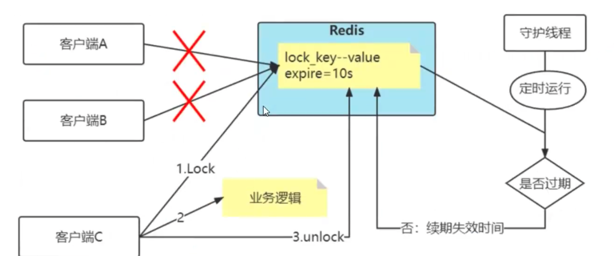

### redis 分布式锁的最简单实现

想要实现分布式锁,必须要求 redis 有 **互斥** 的能力, 可以使用`SETNX` 命令, 这个命令表示 SET if Not Exists, 即如果 key 不存在, 才会设置它的值, 否则什么也不做

#### 存在问题

当客户端 1 拿到锁后, 如果发生如下场景, 就会造成 **死锁**

1.   程序处理业务逻辑异常, 没及时释放锁
2.   进程挂了, 没机会释放锁

这时, 这个客户端就会一直占用这个锁, 而其他客户端就永远拿不到这把锁

### 如何避免死锁

很容易想到的方案是, 在申请锁时, 给锁设置一个 "租期"

在 redis 中实现时, 就是给这个 key 设置一个过期时间. 

###  锁的过期时间不好评估怎么办?

假设 key 的失效时间是 10s, 但是客户端C拿到分布式锁之后, 业务逻辑执行超过 10s, 那么在客户端 C 释放锁之前, 这把锁就失效了, 那么其他客户端就可以去拿锁

比较简单的妥协方案是, 尽量 [冗余] 过期时间, 降低锁提前释放的概率, 但是这个并不完美

### 分布式锁加入看门狗

加锁时, 先设置一个过期时间, 然后我们开启一个**守护线程**, 定时去检测这个锁的失效时间, 如果锁快要过期了, 操作共享资源还未完成, 那就自动对锁进行**续期**, 重新设置过期时间

这个守护线程一般也称为**看门狗**线程

